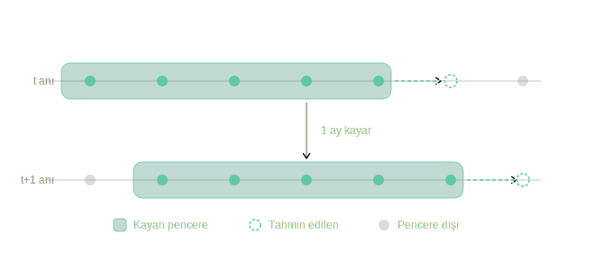
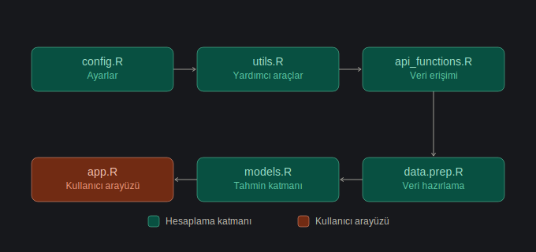
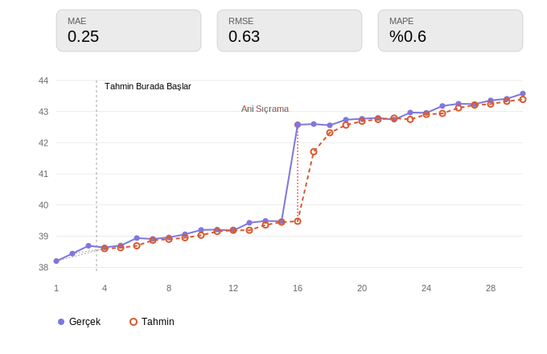

# EKK Tabanlı Ekonometrik Yaklaşımla Finansal Değişkenlerin Tahmini


Türkiye ekonomisine ilişkin açık kaynaklı verilerle çalışan, kayan pencere (rolling window) yaklaşımıyla güncellenen Otoregresif (AR) modelleri En Küçük Kareler (EKK) yöntemiyle tahmin eden ve sonuçları interaktif bir web arayüzü üzerinden sunan uçtan uca bir ekonomik tahmin sistemidir.

Bu proje, TÜBİTAK 2209-A Üniversite Öğrencileri Araştırma Projeleri Destekleme Programı kapsamında geliştirilmiştir.

---

## İçindekiler

1. [Genel Bakış](#1-genel-bakış)
2. [Metodoloji](#2-metodoloji)
3. [Sistem Mimarisi](#3-sistem-mimarisi)
4. [Dizin Yapısı](#4-dizin-yapısı)
5. [Kurulum](#5-kurulum)
6. [Kullanım](#6-kullanım)
7. [Yapılandırma](#7-yapılandırma)
8. [Modül Referansı](#8-modül-referansı)
9. [Genişletilebilirlik](#9-genişletilebilirlik)
10. [Tasarım İlkeleri](#10-tasarım-i̇lkeleri)
11. [Lisans](#13-lisans)
12. [Kaynakça](#14-kaynakça)

---

## 1. Genel Bakış

Ekonomik göstergelerdeki yüksek volatilite, güncellenebilir ve güvenilir tahmin araçlarına duyulan ihtiyacı artırmaktadır. Sabit parametreli klasik zaman serisi modelleri, yapısal kırılmalar karşısında genellikle yetersiz performans göstermektedir.

Bu sistem, söz konusu kısıtı gidermek amacıyla, AR-EKK modellerini sabit bir kalıba sığdırmak yerine **kayan pencere** yaklaşımıyla periyodik olarak yeniden tahmin eder. Böylece model, değişen ekonomik koşullara sürekli uyum sağlar.

### Temel İşlevler

- Açık kaynaklı API'lerden (FRED, TCMB EVDS, Dünya Bankası) otomatik veri toplama
- Farklı frekanslardaki (günlük, aylık, yıllık) serilerin ortak bir aylık takvime hizalanması
- Kayan pencere yöntemiyle her periyotta yeniden tahmin edilen AR-EKK modelleri
- Örnek dışı (out-of-sample) tahmin performansının MAE, RMSE ve MAPE metrikleriyle ölçülmesi
- Sonuçların Shiny tabanlı interaktif bir arayüzde sunulması

### Araştırma Sorusu

Açık kaynaklı veri tabanlarından API aracılığıyla elde edilen Türkiye ekonomik göstergeleri, kayan pencere yöntemiyle güncellenen AR-EKK modelleri kullanılarak anlamlı doğrulukla tahmin edilebilir mi?

### Kapsanan Göstergeler

| Gösterge | Kaynak | Frekans |
|---|---|---|
| USD/TRY Döviz Kuru | FRED | Günlük |
| TÜFE Enflasyon Oranı | TCMB EVDS | Aylık |
| Politika Faizi | TCMB EVDS | Aylık |
| İşsizlik Oranı | FRED | Aylık |
| GSYH Büyüme Oranı | Dünya Bankası | Yıllık |

Yeni gösterge tanımlamak, yapılandırma dosyasına tek bir kayıt eklemekten ibarettir; bkz. [Bölüm 9](#9-genişletilebilirlik).

---

## 2. Metodoloji

### 2.1. Otoregresif (AR) Model

p'inci dereceden bir otoregresif süreç şu şekilde tanımlanır:

$$
y_t = c + \varphi_1 y_{t-1} + \varphi_2 y_{t-2} + \dots + \varphi_p y_{t-p} + \varepsilon_t
$$

$$
\varepsilon_t \sim N(0, \sigma^2)
$$

Burada $y_t$ t anındaki gösterge değerini, $c$ sabit terimi, $\varphi_1, \dots, \varphi_p$ otoregresif katsayıları, $y_{t-k}$ k dönem önceki gecikmeli değeri ve $\varepsilon_t$ hata terimini (beyaz gürültü) ifade eder.

### 2.2. En Küçük Kareler (EKK) Tahmincisi

Model parametreleri, hata kareler toplamını minimize eden EKK yöntemiyle tahmin edilir:

$$
\hat{\beta} = (X^\top X)^{-1} X^\top Y
$$

Burada $\hat{\beta}$ parametre vektörünün EKK tahminini, $X$ tasarım (regresör) matrisini, $X^\top$ bu matrisin transpozunu ve $Y$ bağımlı değişken vektörünü temsil eder.

Gauss-Markov teoremi altında EKK tahmincisi, doğru model varsayımları koşuluyla En İyi Doğrusal Tarafsız Tahmin Edici (BLUE) özelliğini taşır.

### 2.3. Kayan Pencere Yaklaşımı

Her tahmin anı $t$ için yalnızca $[t-w,\ t]$ aralığındaki gözlemler kullanılarak model yeniden tahmin edilir ve **görülmemiş** $t+1$ dönemi öngörülür. Ardından pencere bir adım kaydırılır ve süreç tekrarlanır:

<p align="center">
  
</p>

$$
t \text{ anında:} \quad D_t = \{y_{t-w}, \dots, y_t\} \;\rightarrow\; \hat{\beta}_t = (X_t^\top X_t)^{-1} X_t^\top Y_t \;\rightarrow\; \hat{y}_{t+1|t}
$$

$$
t+1 \text{ anında:} \quad D_{t+1} = \{y_{t-w+1}, \dots, y_{t+1}\} \;\rightarrow\; \hat{\beta}_{t+1} \;\rightarrow\; \hat{y}_{t+2|t+1}
$$

Bu yapı, örnek dışı testin metodolojik bütünlüğünü garanti eder: tahmin edilen dönem, tanımı gereği hiçbir zaman eğitim kümesine dahil edilmez. Pencere uzunluğu (varsayılan: 48 ay) yapılandırma dosyasından ayarlanabilir; literatürde tipik aralık 36-60 aydır (Pesaran & Timmermann, 2007; Rossi & Inoue, 2012).

### 2.4. Performans Metrikleri

$$
\text{MAE} = \frac{1}{n} \sum_{t=1}^{n} \left| y_t - \hat{y}_t \right|
$$

$$
\text{RMSE} = \sqrt{\frac{1}{n} \sum_{t=1}^{n} \left( y_t - \hat{y}_t \right)^2}
$$

$$
\text{MAPE} = \frac{100}{n} \sum_{t=1}^{n} \left| \frac{y_t - \hat{y}_t}{y_t} \right|
$$

| Metrik | Kullanım Amacı |
|---|---|
| **MAE** | Ölçek bağımlı, yorumlanması doğrudan |
| **RMSE** | Büyük sapmaları orantısız biçimde cezalandırır |
| **MAPE** | Farklı ölçekteki göstergeler arasında karşılaştırılabilirlik sağlar |

Optimal gecikme uzunluğu $p$, aşağıdaki bilgi kriterleri esas alınarak belirlenir; en düşük değeri veren model seçilir:

$$
\text{AIC} = -2\ln(L) + 2k
$$

$$
\text{BIC} = -2\ln(L) + k \ln(n)
$$

Burada $L$ maksimum olabilirlik değerini, $k$ parametre sayısını ve $n$ gözlem sayısını ifade eder.

---

## 3. Sistem Mimarisi

Sistem, tek yönlü bir bağımlılık zinciriyle bağlı altı katmandan oluşur. Her katman tek bir sorumluluğa sahiptir ve yalnızca kendisinden önceki katmanlara bağımlıdır.

<p align="center">
  
</p>

| Katman | Dosya | Sorumluluk |
|---|---|---|
| Yapılandırma | `R/config.R` | API uç noktaları, gösterge tanımları, model ve saklama parametrelerinin merkezi yönetimi |
| Yardımcı Fonksiyonlar | `R/utils.R` | Günlükleme, önbellekleme, zaman serisi bölme, formül oluşturma |
| Veri Erişim Katmanı | `R/api_functions.R` | Harici API'lerden veri çekme; kaynak-bağımsız standart çıktı üretimi |
| Veri Hazırlama | `R/data.prep.R` | Frekans hizalama, eksik veri doldurma, türetilmiş değişken üretimi |
| Tahmin Katmanı | `R/models.R` | AR-EKK model kurulumu, kayan pencere tahmini, performans değerlendirmesi |
| Kullanıcı Arayüzü | `app/app.R` | Shiny tabanlı interaktif sunum katmanı |

Her modül, yüklenme sırasında bağımlılıklarının mevcut olduğunu (`stop()` ile) ve kendi bütünlüğünü (`local({...})` bloğuyla) doğrular. Bu, yapılandırma hatalarının çalışma zamanında belirsiz istisnalar yerine, kaynağında açık ve tanımlı hata mesajlarıyla tespit edilmesini sağlar.

---

## 4. Dizin Yapısı

```
eco-forecast-ekk/
├── R/
│   ├── config.R              Merkezi yapılandırma
│   ├── utils.R                Yardımcı fonksiyonlar
│   ├── api_functions.R        Veri erişim katmanı
│   ├── data.prep.R            Veri hazırlama katmanı
│   └── models.R               Tahmin katmanı
├── app/
│   └── app.R                  Shiny arayüzü
├── data/
│   ├── cache/                 Ham veri önbelleği (tazelik kontrollü)
│   └── processed/             İşlenmiş veri (.rds / .csv)
├── models/                    Tahmin özet tabloları
├── logs/
│   └── calisma.log            Zaman damgalı çalışma kayıtları
├── tests/                     Otomatik test dosyaları
├── .Renviron                  API kimlik bilgileri (versiyon kontrolüne dahil değildir)
├── .gitignore
└── README.md
```

---

## 5. Kurulum

### 5.1. Ön Koşullar

- R sürüm 4.1 veya üzeri (önerilen: 4.3+)
- RStudio (isteğe bağlı)
- FRED ve TCMB EVDS için ücretsiz API anahtarları

### 5.2. Depoyu Klonlama

```bash
git clone https://github.com/<kullanici-adi>/eco-forecast-ekk.git
cd eco-forecast-ekk
```

### 5.3. Bağımlılıkların Kurulumu

```r
install.packages(c(
  "dplyr", "tidyr", "zoo", "xts", "tseries", "lubridate",
  "fredr", "httr", "jsonlite", "wbstats",
  "shiny", "shinydashboard", "plotly", "DT", "shinyWidgets"
))
```

### 5.4. Ortam Değişkenlerinin Tanımlanması

Proje kök dizininde bir `.Renviron` dosyası oluşturulmalıdır:

```
FRED_API_KEY=<api_anahtariniz>
EVDS_API_KEY=<api_anahtariniz>
```

Değişikliklerin etkili olması için R oturumunun yeniden başlatılması gerekir.

---

## 6. Kullanım

### 6.1. Uçtan Uca Çalıştırma

```r
source("R/config.R")
source("R/utils.R")
source("R/api_functions.R")
source("R/data.prep.R")
source("R/models.R")

ozet <- calistir_hepsi()
print(ozet[order(ozet$MAPE), ])
```

`calistir_hepsi()` fonksiyonu, işlenmiş veri mevcut değilse veri toplama ve hazırlama adımlarını otomatik olarak yürütür; ardından tüm göstergeler için kayan pencere tahminlerini üretir ve sonuçları kaydeder.

### 6.2. Web Arayüzünün Başlatılması

```r
shiny::runApp("app/app.R")
```

Arayüz üzerinden gösterge seçimi ve pencere uzunluğu parametreleri interaktif olarak değiştirilebilir; grafik, performans metrikleri ve tahmin tablosu seçime bağlı olarak otomatik güncellenir.

<p align="center">
  
</p>

---

## 7. Yapılandırma

Tüm sistem parametreleri `R/config.R` içinde tek bir `CONFIG` nesnesinde toplanmıştır.

```r
CONFIG$model$pencere_uzunlugu        # 48
CONFIG$model$lag_sayisi              # 3
CONFIG$veri$baslangic_tarihi         # "2000-01-01"
CONFIG$gostergeler$ENFLASYON$kod     # "TP.FG.J0"
```

| Parametre | Konum | Varsayılan |
|---|---|---|
| Kayan pencere uzunluğu | `model$pencere_uzunlugu` | 48 ay |
| Gecikme derecesi (AR order) | `model$lag_sayisi` | 3 |
| Veri başlangıç tarihi | `veri$baslangic_tarihi` | 2000-01-01 |
| Eğitim/sınama oranı | `model$egitim_orani` | 0.80 |
| Önbellek tazelik süresi | `veri$cache_tazelik_gun` | 1 gün |

API anahtarları, `config.R` içinde değer olarak değil, `Sys.getenv()` çağrısıyla `.Renviron` dosyasından okunur. Bu sayede `config.R` güvenle paylaşılabilirken, kimlik bilgileri versiyon kontrolüne dahil edilmez.

---

## 8. Modül Referansı

### `R/config.R`

Merkezi ayar deposu. Beş ana küme içerir: bağlantı, veri, model, saklama, göstergeler. Her gösterge, kaynağı ve kodunu birlikte taşıyan bir kimlik kaydı olarak tanımlanır.

### `R/utils.R`

| Fonksiyon | Açıklama |
|---|---|
| `varsayilan(deger, yedek)` | Eksik değeri makul bir varsayılanla değiştirir |
| `log_msg(mesaj)` | Zaman damgalı günlük kaydı (konsol + dosya) |
| `cache_yaz()` / `cache_oku()` | Tazelik kontrollü veri önbellekleme |
| `ikili_kaydet(veri, ad)` | Veriyi hem RDS hem CSV formatında saklar |
| `tarihe_gore_bol(veri)` | Zaman serisini kronolojik sırayla eğitim/sınama olarak böler |
| `formul_kur(hedef, girdiler, ...)` | Model formülünü programatik olarak oluşturur |
| `yeni_olanlar(veri, tarih_sutunu, eski_tarih)` | Artımlı güncelleme için yalnızca yeni gözlemleri filtreler |

### `R/api_functions.R`

| Fonksiyon | Açıklama |
|---|---|
| `fred_cek()` / `evds_cek()` / `worldbank_cek()` | Kaynağa özel veri çekme fonksiyonları; standart üç sütunlu (`tarih`, `deger`, `kimlik`) çıktı üretir |
| `fetch_indicator(gosterge_adi)` | Kaynak yönlendirmesini `config.R`'daki tanıma göre otomatik yapan tekil giriş noktası; önbelleği kontrol eder, hata durumunda çökmeden `NULL` döner |
| `tum_gostergeleri_cek()` | Tüm göstergeleri tek bir tabloda birleştirir; bir kaynağın başarısız olması diğerlerini etkilemez |
| `veri_tazeligi()` | Bir göstergenin en güncel gözlem tarihini raporlar |

### `R/data.prep.R`

| Fonksiyon | Açıklama |
|---|---|
| `bosluk_olc()` | Eksik veri miktarını ölçer (işlem öncesi/sonrası karşılaştırma için) |
| `aylik_takvime_otur()` | Farklı frekanslardaki verileri ortak aylık takvime hizalar |
| `bosluklari_doldur()` | Ara boşlukları doğrusal enterpolasyonla, uç boşlukları en yakın değerle doldurur |
| `degiskenleri_turet()` | Gecikme (lag), fark, trend ve mevsimsellik değişkenlerini üretir |
| `bastaki_artigi_temizle()` | Türetme işleminden kaynaklanan başlangıç eksikliklerini temizler |
| `veriyi_hazirla()` | Yukarıdaki adımları sabit sırada birleştiren ana işlem hattı |

### `R/models.R`

| Fonksiyon | Açıklama |
|---|---|
| `basit_ar()` | Tek periyotluk temel AR-EKK modeli (doğrulama amaçlı) |
| `mae()` / `rmse()` / `mape()` | Performans metrikleri |
| `kayan_pencere_tahmin()` | Ana tahmin fonksiyonu; kayan pencere ile örnek dışı tahmin üretir |
| `tum_gostergeleri_tahminle()` | Tüm göstergeler için tahmin sürecini yürütür ve özetler |
| `calistir_hepsi()` | Uçtan uca işlem hattını tetikleyen ana giriş noktası |

### `app/app.R`

Shiny çerçevesinde UI (arayüz düzeni) ve server (hesaplama mantığı) ayrı tutulmuştur. Kullanıcı girdisi (`reactive`) tek bir kaynaktan grafik, metrik tablosu ve tahmin tablosuna eşzamanlı olarak yansıtılır.

---

## 9. Genişletilebilirlik

| Gereksinim | Yapılacak Değişiklik |
|---|---|
| Yeni gösterge eklemek | `config.R` içindeki `gostergeler` listesine bir kimlik kaydı eklemek yeterlidir |
| Yeni veri kaynağı entegre etmek | `api_functions.R`'a bir tercüman fonksiyonu ve `fetch_indicator()` içine bir koşul dalı eklemek |
| Yeni türetilmiş değişken tanımlamak | `data.prep.R` içindeki `degiskenleri_turet()` fonksiyonuna bir sütun eklemek |
| Yeni performans metriği eklemek | `models.R`'a `function(gercek, tahmin)` imzalı bir fonksiyon ve özet tabloya karşılık gelen sütunu eklemek |

Her durumda değişiklik, ilgili katmanla sınırlı kalır; diğer katmanlar yeniden düzenleme gerektirmez.

---

## 10. Tasarım İlkeleri

- **Tekil sorumluluk:** Her modül tek bir işlevden sorumludur.
- **Merkezi yapılandırma:** Sistem genelindeki tüm kararlar tek bir yapılandırma noktasından yönetilir.
- **Sınır izolasyonu:** Harici veri kaynaklarının değişkenliği ve güvenilmezliği, tek bir erişim katmanında izole edilir.
- **Zarif hata yönetimi:** Bileşen hataları sistemin tamamını durdurmaz; ilgili birim atlanarak işleme devam edilir.
- **Metodolojik dürüstlük:** Kayan pencere tahmininde, tahmin edilen dönem hiçbir koşulda eğitim kümesine dahil edilmez.
- **Kendini doğrulama:** Her modül, yüklenme anında kendi bütünlüğünü ve bağımlılıklarını kontrol eder.
- **Kimlik bilgisi izolasyonu:** API anahtarları kaynak koduna gömülmez; ortam değişkenleri aracılığıyla yönetilir.

---

## 11. Lisans

Bu proje açık kaynak kodlu olarak yayımlanması planlanmaktadır. Lisans türü belirlenme aşamasındadır (örn. MIT).

---

## 12. Kaynakça

- Pesaran, M. H., & Timmermann, A. (2007). *Selection of estimation window in the presence of breaks.* Journal of Econometrics.
- Rossi, B., & Inoue, A. (2012). *Out-of-sample forecast tests robust to the choice of window size.* Journal of Business & Economic Statistics.
- Wooldridge, J. M. (2016). *Introductory Econometrics: A Modern Approach* (6th ed.). Cengage Learning.
- Reinhart, C. M., & Rogoff, K. S. (2009). *This Time Is Different: Eight Centuries of Financial Folly.* Princeton University Press.

Tam kaynakça için proje araştırma önerisi dokümanına başvurunuz.
